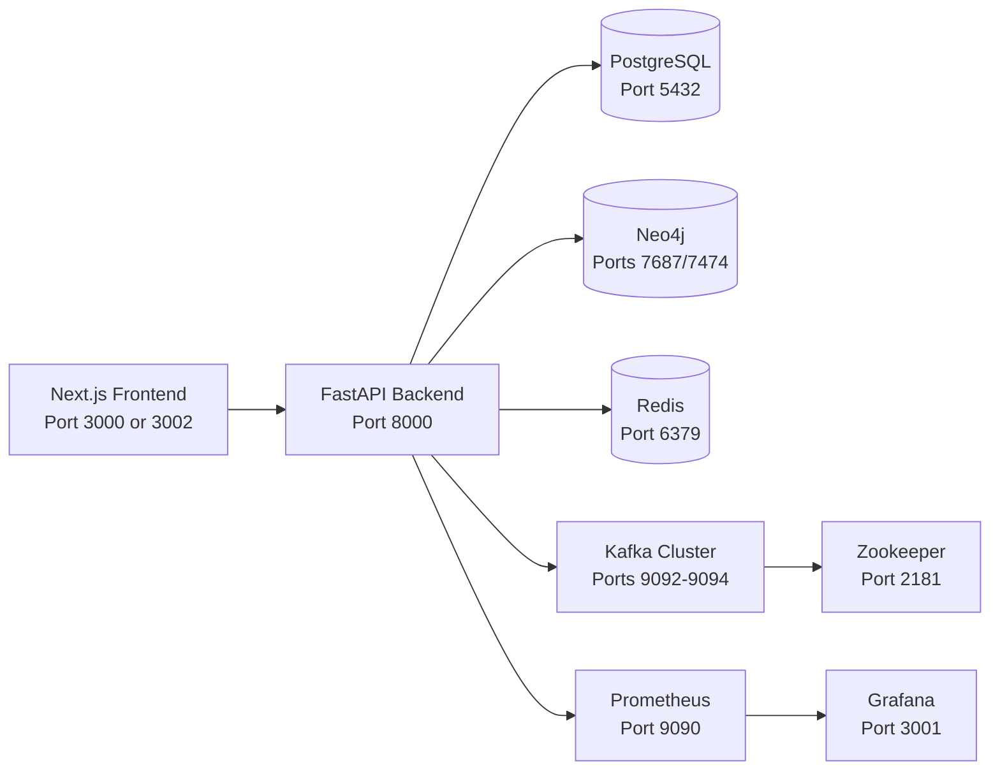

# ONTORA Setup Guide

This guide consolidates local setup, Docker setup, seeding instructions, and architecture details for the full ONTORA stack.

## 1. System Architecture

### 1.1 High-Level Architecture



### 1.2 App Modules

- Frontend: Next.js App Router in app
- Backend: FastAPI in backend
- Data Stores:
- PostgreSQL for relational/metrics/security data
- Neo4j for ontology/graph relationships
- Redis for cache/session acceleration
- Streaming: Kafka 3-broker cluster + Zookeeper
- Observability: Prometheus + Grafana

### 1.3 Default Ports and Credentials

| Service | URL / Host | Credentials |
|---|---|---|
| Frontend | http://localhost:3000 (or 3002) | N/A |
| Backend API | http://localhost:8000 | N/A |
| Swagger | http://localhost:8000/docs | N/A |
| PostgreSQL | localhost:5432 | ontora_user / ontora_password |
| Neo4j Browser | http://localhost:7474 | neo4j / neo4j_password |
| Neo4j Bolt | localhost:7687 | neo4j / neo4j_password |
| Redis | localhost:6379 | N/A |
| Kafka brokers | localhost:9092,9093,9094 | N/A |
| Zookeeper | localhost:2181 | N/A |
| Prometheus | http://localhost:9090 | N/A |
| Grafana | http://localhost:3001 | admin / admin |

## 2. Prerequisites

## 2.1 Required

- Docker Desktop + Docker Compose v2+
- Node.js 18+
- Python 3.11+ (3.12 recommended for best compatibility)
- Git

## 2.2 Recommended (Windows)

- PowerShell 5.1+
- Python virtual environment in workspace root

## 3. Setup Methods

## 3.1 Method A: Full Stack via Docker (Recommended)

1. Go to repo root:

```powershell
Set-Location d:\DMC_Hackathon
```

2. Start infrastructure + backend:

```powershell
docker-compose up -d
```

3. Verify containers:

```powershell
docker-compose ps
```

4. Start frontend in another terminal:

```powershell
Set-Location d:\DMC_Hackathon
npm install
npm run dev
```

5. Open:

- Frontend: http://localhost:3000
- Backend docs: http://localhost:8000/docs

## 3.2 Method B: Hybrid (Docker Infra + Local Backend + Local Frontend)

Use this if you want hot-reload backend debugging locally.

1. Start only infra services:

```powershell
Set-Location d:\DMC_Hackathon
docker-compose up -d postgres neo4j redis zookeeper kafka-1 kafka-2 kafka-3 prometheus grafana
```

2. Start local backend:

```powershell
Set-Location d:\DMC_Hackathon\backend
python -m uvicorn main:app --host 0.0.0.0 --port 8000 --reload
```

3. Start local frontend:

```powershell
Set-Location d:\DMC_Hackathon
npm install
npm run dev
```

## 3.3 Method C: Frontend-Only UI Development

Use when backend APIs are not required.

```powershell
Set-Location d:\DMC_Hackathon
npm install
npm run dev
```

If needed, set frontend API fallback in environment to backend URL:

- NEXT_PUBLIC_API_BASE_URL=http://127.0.0.1:8000

## 4. Environment Configuration

Common backend runtime values used by docker-compose:

- POSTGRES_HOST=postgres
- POSTGRES_PORT=5432
- POSTGRES_USER=ontora_user
- POSTGRES_PASSWORD=ontora_password
- POSTGRES_DB=ontora_prod
- NEO4J_HOST=neo4j
- NEO4J_PORT=7687
- NEO4J_USER=neo4j
- NEO4J_PASSWORD=neo4j_password
- REDIS_HOST=redis
- REDIS_PORT=6379
- KAFKA_BROKERS=kafka-1:29092,kafka-2:29092,kafka-3:29092

Frontend commonly uses:

- NEXT_PUBLIC_API_BASE_URL=http://127.0.0.1:8000

## 5. Seeding Instructions

## 5.1 Recommended Full Seed (One Command)

From repo root:

```powershell
Set-Location d:\DMC_Hackathon
python seed_all.py
```

This seeds broad geopolitical and graph data used by dashboards.

## 5.2 Available Seed Scripts (Targeted)

The repo contains these seed scripts:

- seed_all.py
- seed_data.py
- seed_simple.py
- seed_expanded_countries.py
- seed_knowledge_graph.py
- seed_kg_relationships.py
- seed_ontology_entities.py
- seed_predictions_metrics.py
- seed_infrastructure_metrics.py
- seed_intelligence_dashboard.py
- seed_intelligence_alerts.py
- seed_intelligence_alerts_safe.py
- seed_mea_data.py
- seed_indiapi_data.py

Run individual scripts as needed:

```powershell
python seed_data.py
python seed_knowledge_graph.py
python seed_predictions_metrics.py
```

## 5.3 Bill Analysis Sample Data

For bill-analysis demo flow:

```powershell
Set-Location d:\DMC_Hackathon
python create_sample_bills.py
python bill_analysis_setup.py
```

## 5.4 Suggested Seed Order (If Not Using seed_all.py)

1. seed_data.py
2. seed_expanded_countries.py
3. seed_knowledge_graph.py
4. seed_kg_relationships.py
5. seed_ontology_entities.py
6. seed_intelligence_dashboard.py
7. seed_infrastructure_metrics.py
8. seed_predictions_metrics.py
9. Optional domain scripts (MEA/India/bill-analysis)

## 5.5 Verify Seeded Data

API checks:

```powershell
Invoke-WebRequest -Uri "http://localhost:8000/health" -UseBasicParsing
Invoke-WebRequest -Uri "http://localhost:8000/api/metrics/regional-risk" -UseBasicParsing
Invoke-WebRequest -Uri "http://localhost:8000/api/knowledge-graph/nodes" -UseBasicParsing
Invoke-WebRequest -Uri "http://localhost:8000/api/geospatial/hotspots" -UseBasicParsing
```

Database quick check:

```powershell
docker-compose exec postgres psql -U ontora_user -d ontora_prod -c "SELECT COUNT(*) FROM countries;"
```

## 6. Startup and Operational Flow

## 6.1 Normal Dev Startup

1. Start infra (docker-compose)
2. Start backend (docker or local)
3. Run seed scripts (if fresh DB)
4. Start frontend
5. Open dashboard pages and validate APIs

## 6.2 Stop / Reset

Stop but keep data:

```powershell
docker-compose stop
```

Stop and remove containers:

```powershell
docker-compose down
```

Hard reset (delete volumes/data):

```powershell
docker-compose down -v
```

## 7. Architecture Details by Layer

## 7.1 Frontend Layer

- Framework: Next.js (App Router)
- Primary UI routes include:
- Strategic overview
- Intelligence, geospatial, knowledge graph
- Predictions, data streams, data lake, security
- Landing and login flows

## 7.2 Backend Layer

- FastAPI service exposes metrics, intelligence, geospatial, graph, security, and auth APIs.
- Backend depends on PostgreSQL, Neo4j, Redis, Kafka.

## 7.3 Data Layer

- PostgreSQL: tabular operational data and logs
- Neo4j: entities/relationships/ontology graph traversal
- Redis: cache/session data acceleration

## 7.4 Streaming Layer

- Kafka cluster with 3 brokers for real-time pipelines.
- Zookeeper coordinates Kafka broker metadata.

## 7.5 Monitoring Layer

- Prometheus scrapes metrics.
- Grafana visualizes dashboards.

## 8. Troubleshooting

## 8.1 Port Already In Use

Check and free port (example 8000):

```powershell
netstat -ano | findstr :8000
taskkill /PID <PID> /F
```

## 8.2 Backend Health Fails

1. Confirm postgres/neo4j/redis containers are healthy:

```powershell
docker-compose ps
```

2. Read backend logs:

```powershell
docker-compose logs -f backend
```

3. Retry:

```powershell
Invoke-WebRequest -Uri "http://localhost:8000/health" -UseBasicParsing
```

## 8.3 Frontend Cannot Reach Backend

Use explicit loopback in frontend env:

- NEXT_PUBLIC_API_BASE_URL=http://127.0.0.1:8000

Then restart frontend dev server.

## 9. Related Docs

For deeper topic-specific instructions, see:

- [README.md](README.md)
- [LOCAL_SETUP.md](LOCAL_SETUP.md)
- [backend/README.md](backend/README.md)
- [SEEDING_COMPLETE.md](SEEDING_COMPLETE.md)
- [DEPLOYMENT_GUIDE.md](DEPLOYMENT_GUIDE.md)
- [MONITORING_SETUP.md](MONITORING_SETUP.md)
- [BILL_ANALYSIS_README.md](BILL_ANALYSIS_README.md)
